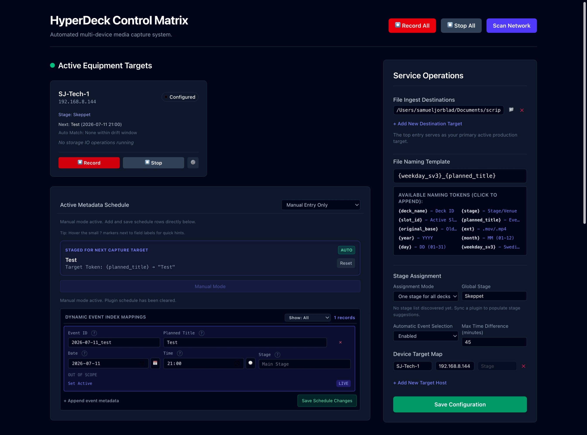

# HyperDeck Tools

A FastAPI + frontend control panel for multi-HyperDeck workflows with:
- deck monitoring and discovery
- config management (destinations, naming template, stages)
- schedule sync via plugins
- automatic active-event selection with drift control

## Features

- Active Equipment dashboard with per-deck next event and auto-match info
- Stage-aware scheduling:
  - one global stage for all decks
  - or per-deck stage assignment
- Dynamic Event Index Mappings with:
  - in-scope filtering
  - manual row editing
  - date/time/stage support
- Plugin system for schedule ingestion
  - `gullbrannafestivalen_scraper`
  - `excel_schedule_uploader` (default Excel upload plugin)

## UI Screenshot



## Requirements

Install dependencies:

```bash
pip install -r requirements.txt
```

## Run

```bash
python run.py
```

Open:
- `http://localhost:8008`

## Update

Run the update script to pull the latest changes and install updated dependencies:

```bash
./update.sh
```

This will:
- Stash any local changes before updating
- Pull the latest from the repository
- Install/update Python requirements
- Restore your stashed changes

Restart the service after updating if running as a systemd service:

```bash
sudo systemctl restart hyperdeck-tools
```

## Run as a systemd Service (Linux)

Create a service file:

```bash
sudo nano /etc/systemd/system/hyperdeck-tools.service
```

Paste the following (adjust paths and user as needed):

```ini
[Unit]
Description=HyperDeck Tools
After=network.target

[Service]
Type=simple
User=your-user
WorkingDirectory=/path/to/hyperdeck-tools
ExecStart=/usr/bin/python3 run.py
Restart=on-failure
RestartSec=5

[Install]
WantedBy=multi-user.target
```

Enable and start:

```bash
sudo systemctl daemon-reload
sudo systemctl enable hyperdeck-tools
sudo systemctl start hyperdeck-tools
```

Check status:

```bash
sudo systemctl status hyperdeck-tools
```

View logs:

```bash
journalctl -u hyperdeck-tools -f
```

## Excel Upload Plugin

Plugin name: `excel_schedule_uploader`

Use the upload panel in **Active Metadata Schedule** when this plugin is selected.

Bundled sample workbook:
- [templates/schedule_template.xlsx](/Users/samueljorblad/Documents/scripts/hyperdeck-tools/templates/schedule_template.xlsx)

### Supported Excel format (.xlsx)

First row should contain headers. Recommended headers:
- `start_time` (example: `2026-07-15 19:30`)
- `planned_title`
- `stage`
- `id` (optional)

Also supported as alternatives:
- `title` or `event` instead of `planned_title`
- `date` + `time` instead of `start_time`
- `venue` instead of `stage`

### Example rows

| start_time        | planned_title    | stage       | id |
|------------------|------------------|-------------|----|
| 2026-07-15 19:30 | Evening_Service  | Main Stage  |    |
| 2026-07-15 21:00 | Concert          | Youth Stage |    |

If `id` is missing, one is generated automatically.

If you want a starting point, duplicate and edit the bundled template workbook:
- [templates/schedule_template.xlsx](/Users/samueljorblad/Documents/scripts/hyperdeck-tools/templates/schedule_template.xlsx)

## Auto Event Selection

In Service Operations:
- `Automatic Event Selection`:
  - `Enabled`: active event is auto-selected from nearest in-scope event
  - `Disabled`: use manual Set Active
- `Max Time Difference (minutes)` controls drift tolerance

## Tokens

Naming template supports tokens including:
- `{deck_name}`
- `{stage}`
- `{slot_id}`
- `{planned_title}`
- `{original_base}`
- `{ext}`
- `{year}` `{month}` `{day}`

## Notes

- Schedules are saved in `app/backend/schedule.json`.
- Uploaded files are stored in `app/backend/uploads/`.
- Plugin scripts are in `app/backend/plugins/`.
- HyperDeck model fallback options are in `app/backend/model_capability_profiles.json`.

### Scoped Slate Metadata

Slate metadata is resolved at record time using:

- `global` config metadata (`config.json` -> `slate_metadata.global`)
- `per_deck` config metadata (`config.json` -> `slate_metadata.per_deck`)
- per-event metadata stored directly on each schedule event row (`slate_metadata` in `schedule.json`)

Precedence:

`global` -> `per_deck` -> `event row metadata`

Example config scope:

```json
{
  "slate_metadata": {
    "global": {
      "project name": "Summer Festival 2026",
      "director": "A. Director"
    },
    "per_deck": {
      "MainDeck": {
        "camera": "A"
      },
      "YouthDeck": {
        "camera": "B"
      }
    }
  }
}
```

Example schedule event row:

```json
{
  "id": "opening_service",
  "planned_title": "Opening Service",
  "start_time": "2026-07-15 19:30",
  "stage": "Main Stage",
  "slate_metadata": {
    "scene id": "OPN",
    "environment": "interior",
    "day night": "day"
  }
}
```
